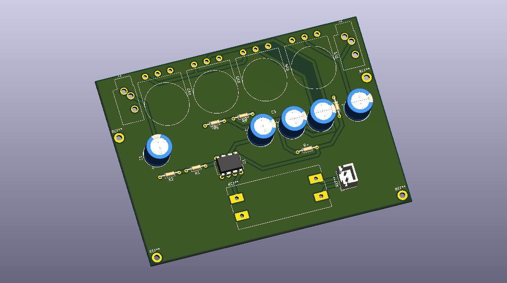
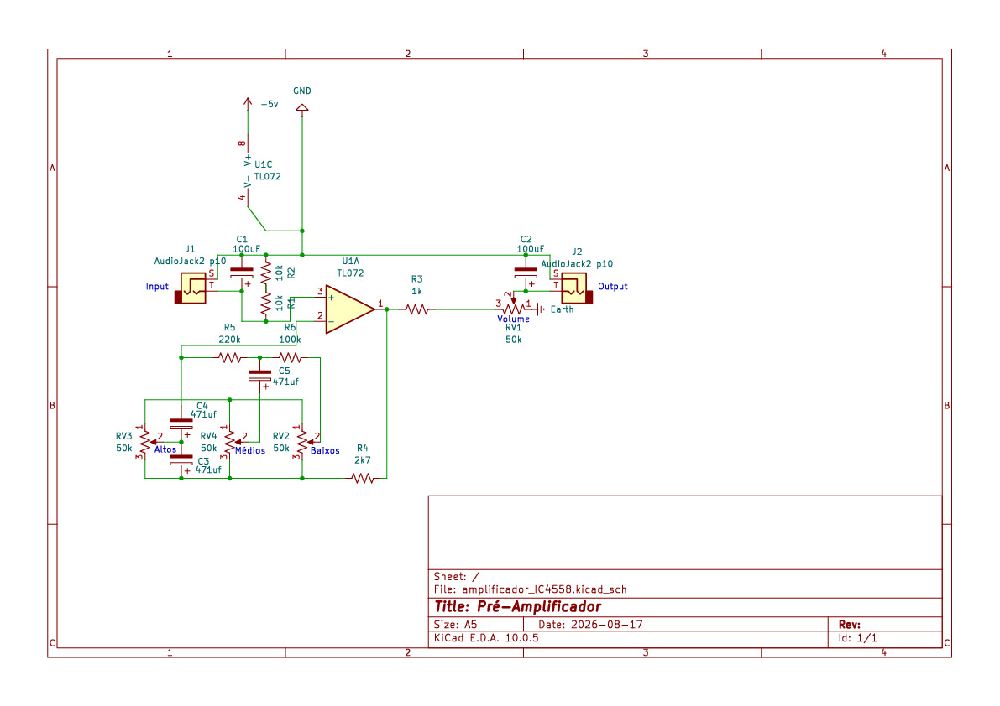
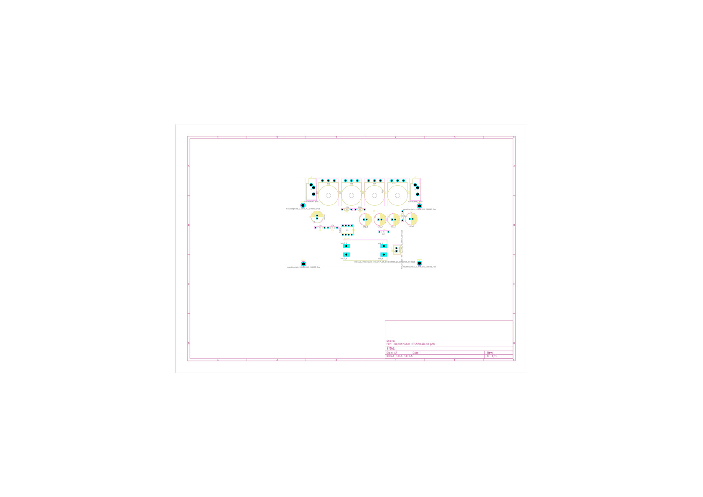

# 🎵 Stereo Audio Pre-Amplifier using RC4558

## 📌 About the Project
This is a PCB layout design for a **stereo audio preamplifier**, created using **KiCad**. The circuit is based on the classic **RC4558** dual-opamp, which is ideal for conditioning and preamplifying weak audio signals before they reach the power amplifier stage.

The layout features standard input/output connections and hybrid components (THT and SMD), with a focus on ease of assembly and low manufacturing costs.

---

## 🛠️ Technical Specifications & Tools
* **Software EDA:** KiCad
* **Number of Layers:** 2 layers (Dual Layer – Top/Bottom)
* **Component Technology:** THT (Through-Hole) & SMD
* **Project Files:** Schematics, PCB layouts, and **Gerber** files ready for manufacturing (JLCPCB / PCBWay)

---

## 📋 Component List (BOM)

### 🔹 Integrated Circuits & Semiconductors
* **1x** RC4558 Integrated Circuit (Dual Op-Amp)
* **1x** Voltage Regulator

### 🔹 Resistors
* **2x** 10kΩ
* **1x** 1kΩ
* **1x** 2k7Ω (2.7kΩ)
* **1x** 220kΩ
* **1x** 100 kΩ
* **4x** 50kΩ potentiometers/variable resistors

### 🔹 Capacitors
* **2x** Electrolytic Capacitors – 100µF each
* **3x** Capacitors – 471µF each

### 🔹 Connectors
* **2x** AudioJack P10 connectors (Input/Output)

---

## 📑 Electrical Schematic & Board Layout

### Electrical Schematic

### Visualization of PCB Layers

